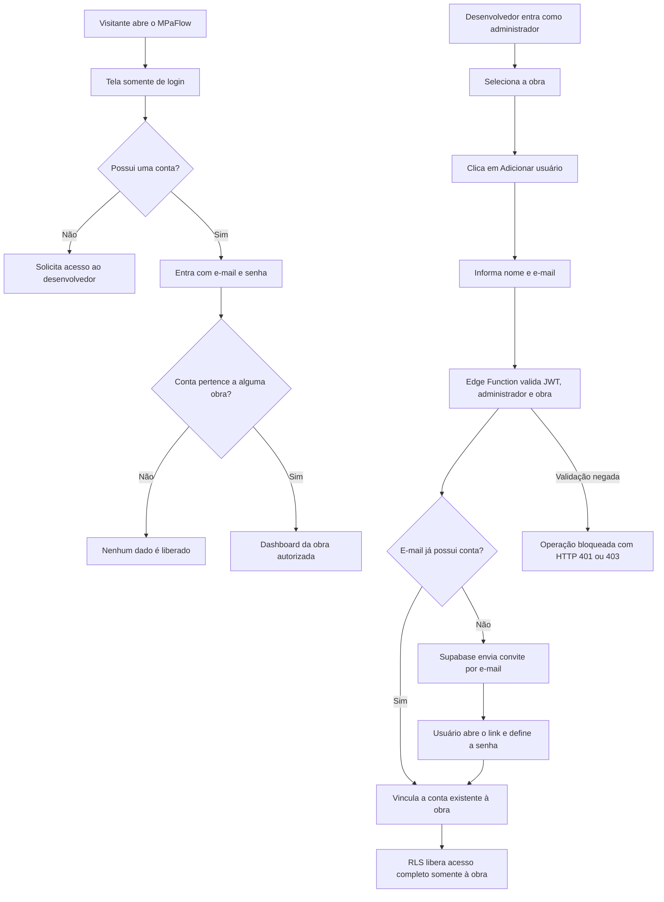

# Acesso fechado e convites administrativos — MPaFlow

## Objetivo

O MPaFlow passa a operar como um sistema privado para clientes de obra:

- não existe cadastro público;
- cada pessoa utiliza sua própria conta;
- somente o desenvolvedor/administrador cria ou vincula acessos;
- o usuário convidado recebe um link para definir a própria senha;
- todos os membros continuam com acesso operacional completo dentro da obra atribuída;
- somente o administrador gerencia quem entra no sistema.

Não é recomendado compartilhar uma única conta entre profissionais. Contas individuais permitem revogar apenas uma pessoa e preservam a identificação de quem criou cada registro.

## Perfis e permissões

| Perfil | Pode fazer |
| --- | --- |
| Administrador da plataforma | Adicionar usuários às obras das quais participa, além de usar todas as funções operacionais |
| Membro da obra | Criar, visualizar, editar e excluir pavimentos, caminhões e corpos de prova da obra |
| Pessoa não autenticada | Visualizar somente a tela de login e solicitar recuperação de senha |
| Usuário sem associação | Autenticar, mas não visualizar dados de nenhuma obra |

O botão **Adicionar usuário à obra** é mostrado apenas ao administrador. Mesmo que alguém tente chamar a API manualmente, a Edge Function valida novamente a sessão, o papel administrativo e a participação do administrador na obra.

## Fluxograma



## Alterações implementadas

### Autenticação

- removida a aba **Cadastrar**;
- removida a chamada `signUp` do frontend;
- mantido somente login de contas existentes;
- adicionada recuperação de senha sem revelar se o e-mail existe;
- criada a rota `/definir-senha` para convites e recuperação;
- senha pessoal com no mínimo oito caracteres na interface.

### Administração

- criada a tabela `platform_admins`;
- criada a função RLS `is_platform_admin()`;
- o botão de adicionar usuário fica invisível para membros comuns;
- o compartilhamento direto pelo navegador foi revogado;
- a conta é criada ou vinculada exclusivamente pela Edge Function `invite-obra-user`.

### Convite server-side

A Edge Function:

1. valida o token do usuário conectado;
2. confirma que ele pertence à tabela `platform_admins`;
3. confirma que ele também participa da obra selecionada;
4. verifica se o e-mail já possui conta;
5. vincula contas existentes diretamente;
6. envia convite para e-mails novos;
7. associa o novo usuário à obra com acesso completo;
8. remove a conta recém-criada caso a associação com a obra falhe.

A credencial administrativa do Supabase permanece apenas no servidor. Ela nunca é enviada para o navegador ou adicionada ao repositório.

### Novos usuários

O gatilho `handle_new_user` agora cria somente o perfil. Ele não cria automaticamente uma obra particular para cada convidado. A Edge Function é responsável por associar a conta à obra correta.

Isso evita que o profissional convidado visualize uma obra pessoal vazia ao lado da obra compartilhada.

## Arquivos principais

- `src/pages/AuthPage.tsx`
- `src/pages/SetPasswordPage.tsx`
- `src/context/AuthContext.tsx`
- `src/context/DataContext.tsx`
- `src/components/ObraSwitcher.tsx`
- `src/integrations/supabase/types.ts`
- `supabase/functions/invite-obra-user/index.ts`
- `supabase/migrations/20260907160000_closed_registration_admin_invites.sql`
- `supabase/migrations_portable/005_closed_registration_admin_invites.sql`

## Implantação obrigatória

### 1. Aplicar a migration

Como as migrations anteriores já foram aplicadas, execute somente:

```text
supabase/migrations/20260907160000_closed_registration_admin_invites.sql
```

### 2. Definir a conta do desenvolvedor como administradora

Substitua o e-mail e execute no SQL Editor:

```sql
INSERT INTO public.platform_admins (user_id, added_by)
SELECT id, id
FROM auth.users
WHERE lower(email) = lower('SEU_EMAIL_DE_DESENVOLVEDOR')
ON CONFLICT (user_id) DO NOTHING;
```

Confirme o resultado:

```sql
SELECT u.email, a.created_at
FROM public.platform_admins a
JOIN auth.users u ON u.id = a.user_id;
```

### 3. Desabilitar o cadastro público

No painel do Supabase:

1. abra **Authentication**;
2. acesse as configurações gerais ou do provedor de e-mail;
3. desabilite **Allow new users to sign up**;
4. mantenha o provedor de e-mail habilitado.

Remover o formulário do frontend melhora a experiência, mas esta configuração do servidor é a barreira que realmente impede cadastros externos.

### 4. Configurar URLs de autenticação

Em **Authentication → URL Configuration**:

- configure **Site URL** com a URL pública do MPaFlow;
- adicione `https://SEU-DOMINIO/definir-senha` às URLs permitidas;
- para desenvolvimento, adicione também `http://localhost:8080/definir-senha`.

### 5. Confirmar o projeto Supabase

Antes de publicar a função, confirme que estes valores apontam para o mesmo projeto:

- `VITE_SUPABASE_URL` no ambiente do frontend;
- `project_id` em `supabase/config.toml`;
- o projeto no qual a migration foi executada.

O checkout atual possui identificadores divergentes e um placeholder no `.env` local. Corrija o ambiente sem enviar chaves ao Git e vincule a CLI ao projeto correto:

```bash
npx supabase link --project-ref SEU_PROJECT_REF
```

Não publique a Edge Function enquanto os identificadores forem diferentes.

### 6. Configurar e publicar a Edge Function

Defina a URL pública, sem barra no final:

```bash
npx supabase secrets set APP_URL=https://SEU-DOMINIO
```

Publique a função:

```bash
npx supabase functions deploy invite-obra-user
```

As variáveis `SUPABASE_URL`, `SUPABASE_ANON_KEY` e `SUPABASE_SERVICE_ROLE_KEY` são fornecidas pelo ambiente hospedado do Supabase. Não coloque a chave administrativa em variáveis `VITE_*`.

### 7. Publicar o frontend

Somente publique o frontend depois que a migration, o administrador, a URL e a Edge Function estiverem configurados.

## Teste de aceitação

1. Abra uma janela anônima e confirme que não existe botão de cadastro.
2. Tente criar uma conta pela API pública e confirme que o Supabase bloqueia porque novos cadastros estão desabilitados.
3. Entre com uma conta comum e confirme que o botão de adicionar usuário não aparece.
4. Entre como administrador e abra **Adicionar usuário à obra**.
5. Convide um e-mail ainda não cadastrado.
6. Abra o e-mail, defina a senha e faça login.
7. Confirme que o novo usuário vê somente a obra atribuída.
8. Crie e edite um registro como o convidado e confirme a alteração na conta do administrador.
9. Adicione um e-mail já cadastrado e confirme que ele é vinculado sem receber novo convite.
10. Tente invocar a Edge Function como usuário comum e confirme o bloqueio `403`.

## Operação diária

Depois da implantação, o fluxo normal será:

1. o cliente informa nome e e-mail do profissional;
2. o desenvolvedor entra no MPaFlow;
3. seleciona a obra correta;
4. usa **Adicionar usuário à obra**;
5. o profissional define a senha pelo e-mail recebido;
6. ambos passam a trabalhar nos mesmos dados.
